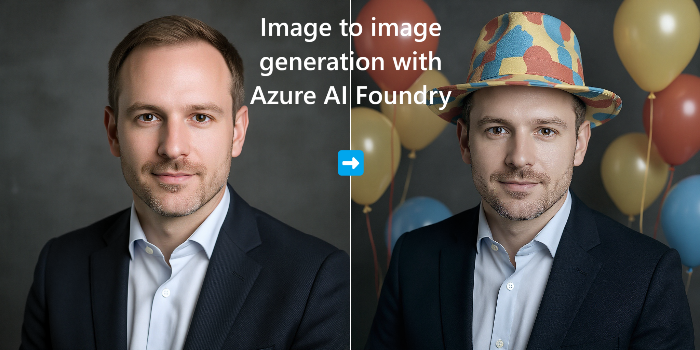

## Image Editing with Azure AI Foundry

This sample performs image edits using Azure AI Foundry image models. It supports:
- GPT-Image-1.5
- FLUX.2-pro

### Prerequisites
- An Azure subscription and access to Azure AI Foundry
- Deploy at least one of these models in Azure AI Foundry:
	- `gpt-image-1.5`
	- `FLUX.2-pro`

Note: Use a Foundry project and note the endpoint and key.

### Set up
1) Clone this repo and open the folder in VS Code.
2) Create and fill a `.env` file at the repo root:

```
FOUNDRY_ENDPOINT=https://<your-project-endpoint>.services.ai.azure.com/
FOUNDRY_API_KEY=<your-project-api-key>
FOUNDRY_API_VERSION=2025-04-01-preview
FLUX_DEPLOYMENT_NAME=FLUX.2-pro
GPT_DEPLOYMENT_NAME=gpt-image-1.5
INPUT_IMAGE=<path to your image with file ending>
PROMPT=<Your edit prompt>

# Image processing settings (optional)
MAX_IMAGE_MP=4.0
MAX_IMAGE_DIMENSION=2048
```

3) (Optional but recommended) Create a virtual environment and activate it.
4) Install dependencies:

```powershell
pip install -r requirements.txt
```

### Usage
Basic run (uses values from `.env`):

```powershell
python .\image2image.py
```

Model selector values:
- `-model gpt` selects `GPT_DEPLOYMENT_NAME` (e.g., `gpt-image-1.5`)
- `-model flux` selects `FLUX_DEPLOYMENT_NAME` (e.g., `FLUX.2-pro`), which is also selected if no model argument is provided

### Image Processing

The script automatically resizes large input images to prevent API timeouts:

- **MAX_IMAGE_MP** (default: 4.0) – Maximum megapixels for input images. FLUX supports up to 4MP.
- **MAX_IMAGE_DIMENSION** (default: 2048) – Maximum width/height in pixels.

Images exceeding these limits are downscaled while preserving aspect ratio. Dimensions are adjusted to multiples of 16 for FLUX compatibility.

**Output sizes:**
- **FLUX**: Matches input dimensions (up to 4MP after resizing)
- **GPT**: Uses predefined sizes (max 1792×1024 or 1536×1536 with `size="auto"`)